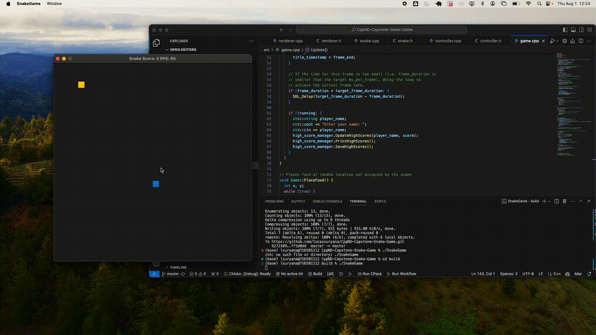

# CPPND: Capstone Snake Game Example

This project is an extended version of the classic [Snake game](https://codereview.stackexchange.com/questions/212296/snake-game-in-c-with-sdl), developed as part of the [Udacity C++ Nanodegree Program](https://www.udacity.com/course/c-plus-plus-nanodegree--nd213). It demonstrates advanced C++ features, including smart pointers, multithreading, and resource management using the Rule of Five.

## Features
- **Snake Game**: A classic Snake game implemented using C++ and SDL2.
- **High Score Management**: Tracks and saves high scores using a `high_score_manager` component. High scores are stored in a file (`highscores.txt`) and are updated every time the player finishes a game. This feature helps keep track of the best scores and adds a competitive edge to the game.
- **Bonus Food**: After the snake eats a certain number of regular foods, a bonus food, which appears in green, will appear. If the snake eats this bonus food, a bonus score will be added. However, the snake has a limited amount of time to consume the bonus food before it disappears. The closer the bonus food is to disappearing, the lower the score it provides.

## Dependencies for Running Locally

* cmake >= 3.7
  * All OSes: [click here for installation instructions](https://cmake.org/install/)
* make >= 4.1 (Linux, Mac), 3.81 (Windows)
  * Linux: make is installed by default on most Linux distros
  * Mac: [install Xcode command line tools to get make](https://developer.apple.com/xcode/features/)
  * Windows: [Click here for installation instructions](http://gnuwin32.sourceforge.net/packages/make.htm)
* SDL2 >= 2.0
  * All installation instructions can be found [here](https://wiki.libsdl.org/Installation)
  >Note that for Linux, an `apt` or `apt-get` installation is preferred to building from source. 
* gcc/g++ >= 5.4
  * Linux: gcc / g++ is installed by default on most Linux distros
  * Mac: same deal as make - [install Xcode command line tools](https://developer.apple.com/xcode/features/)
  * Windows: recommend using [MinGW](http://www.mingw.org/)

## Basic Build Instructions

1. Clone this repo.
2. Make a build directory in the top level directory: `mkdir build && cd build`
3. Compile: `cmake .. && make`
4. Run it: `./SnakeGame`.

## High Score Management

The game includes a `high_score_manager` that manages player scores. The `high_score_manager` does the following:
- **Load High Scores**: When the game starts, it loads previously saved high scores from `highscores.txt`.
- **Update High Scores**: After each game, the player's score is compared to the existing high scores. If the player achieves a new high score, it is updated in the file.
- **Save High Scores**: The updated high scores are saved back to `highscores.txt`, ensuring that the high scores persist across game sessions.
- **Display High Scores**: At the end of each game, the updated high scores are displayed to the player.

## Code modification highlights per rubric
1. Loops, Functions, I/O
* Criteria 1: The project reads data from a file and process the data
  * File: 'game.cpp'
  * Lines: 8-18
  * Explanation: During the construction of the Game class, a file named "highscores.txt" is initialized. The LoadHighScore() method from high_sore_manager class reads from a file with the same name.

* Criteria 2: (1) The project writes data to a file and (2) The project accepts user input and processes the input
  * File: 'game.cpp'
  * Lines: 32-39
  * Explanation: When the snake game stops running, players are required to enter their names. The SaveHighScore() method then saves the scores in a file named "highscores.txt". Before saving, the code updates the existing high scores and sorts them from highest to lowest using the UpdateHighScore() method.

* Criteria 3: The project uses data structures and immutable variables
  * File: 'high_score_manager.cpp'
  * Lines: 11-21
  * Explanation: When the LoadHighScore() method reads the file, it extracts player names along with their corresponding scores. A vector called high_scores stores these values, with each pair of player name and score saved as an individual entry in the vector.

2. Object Oriented Programming
* Criteria 1: One or more classes are added to the project with appropriate access specifiers for class members.
  * Files: 'high_score_manager.cpp', 'high_score_manager.h', 'snake.h', and 'snake.cpp'
  * Explanation: The files high_score_manager.cpp and high_score_manager.h define a new class called HighScoreManager. There is a clear separation between public and private methods and variables in the code. For instance, in 'high_score_manager.h' (lines 31-35), private variables file_name and high_scores, as well as the private method SortHighScore(), are declared. The 'snake.h' file (lines 17-32) includes explicit getter and setter methods and defines private variables such as speed that are subject to invariants. To ensure data integrity, an if-else statement is used in 'snake.cpp' (lines 134-139) to verify that the speed value is always positive.

* Criteria 2: Class constructors utilize member initialization lists.
  * File: snake.cpp
  * Lines: 7-16
  * Explanation: Initialize the snake at the center of the grid with initial settings

* Criteria 3: Classes abstract implementation details from their interfaces.
  * File: 'high_score_manager.cpp'
  * Lines: entire lines of code
  * Explanation: all the methods name is self-explained. The user of the code shall understand how LoadHighScore(), SaveHighScore(), and UpdateHighScore() works as what the methods do is exactly the same as its name.

3. Memory Management
* Criteria 1: The project follows the Rule of 5.
  * File: 'renderer.h'
  * Lines: 10-20

* Criteria 2: The project uses move semantics to move data instead of copying it, where possible.
  * File:'high_score_manager.cpp' and 'renderer.cpp'
  * Lines: 17 (high score manager), 151-152 (renderer) and 164-165 (renderer)
  * Explanation: Move semantics std::move is used to move data of name and score to vector of high_scores in 'high_scores_manager.cpp'. The same move semantics also used to move sdl_window and sdl_renderer in 'renderer.cpp'

* Criteria 3: The project uses smart pointers instead of raw pointers.
  * File: 'renderer.h'
  * Lines: 23-24

4. Concurrency
* Criteria 1: The project uses multithreading.
  * File: 'game.cpp' and 'game.h'
  * Lines: 144-145 (game.cpp), 38 (game.h)
  * Explanation: A new thread is created whenever a bonus food condition is activated. This thread handles the countdown for the bonus food's availability. The bonus food will appear for a limited amount of time, and its remaining time is tracked and updated in real-time. The thread ensures that the bonus food remains visible for the entire duration and manages its disappearance once the time expires.

* Criteria 2: A mutex or lock is used in the project.
  * File: 'game.cpp' and 'game.h'
  * Lines:  108 & 140(game.cpp), 36 (game.h)
  * Explanation: These lines demonstrate the use of a mutex to synchronize access to shared resources between threads. At line 108, a std::lock_guard is used to lock the mutex when checking and updating the state of the is_bonus_food_active flag. This ensures that only one thread can modify this flag at a time, preventing race conditions. Line 140 shows the use of std::unique_lock in conjunction with std::condition_variable to manage the timing and signaling for the bonus food timer. The std::unique_lock allows for waiting on the condition variable and releasing the mutex while waiting, which helps coordinate between the main game loop and the bonus food timer thread.

## License

CC Attribution-ShareAlike 4.0 International

Shield: [![CC BY-SA 4.0][cc-by-sa-shield]][cc-by-sa]

This work is licensed under a
[Creative Commons Attribution-ShareAlike 4.0 International License][cc-by-sa].

[![CC BY-SA 4.0][cc-by-sa-image]][cc-by-sa]

[cc-by-sa]: http://creativecommons.org/licenses/by-sa/4.0/
[cc-by-sa-image]: https://licensebuttons.net/l/by-sa/4.0/88x31.png
[cc-by-sa-shield]: https://img.shields.io/badge/License-CC%20BY--SA%204.0-lightgrey.svg
